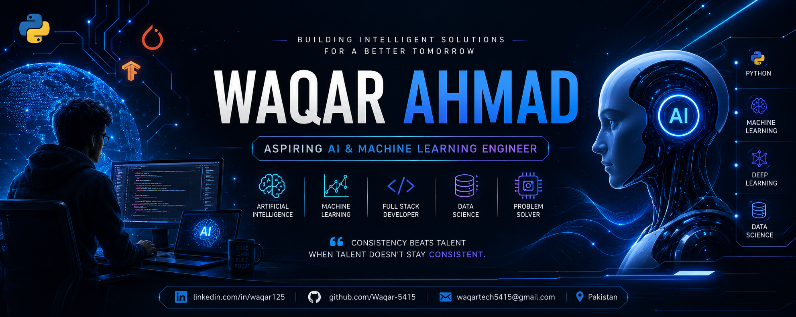

  

<h1 align="center">Hi 👋, I'm Waqar Ahmad</h1>

<h3 align="center">
Artificial Intelligence • Machine Learning • Python Developer
</h3>

---

## 👨‍💻 About Me

🎓 BS Computer Science Student

🏫 Riphah International University

🤖 Aspiring AI & Machine Learning Engineer

🌱 Currently Learning

- Python
- Data Structures & Algorithms
- SQL
- Machine Learning
- Deep Learning

💡 Interested In

- Artificial Intelligence
- Machine Learning
- Computer Vision
- NLP
- Backend Development

🎯 Goal

Become an AI Engineer at a leading technology company by building impactful AI solutions and continuously improving my technical skills.

---

## 🛠 Tech Stack

---

# 🚀 Featured Projects

⭐ AI Voice Assistant

⭐ Library Management System

⭐ Portfolio Website

⭐ Machine Learning Projects

⭐ Online Learning Platform

---

# 📊 GitHub Stats

## 📊 GitHub Statistics

<i>Every commit is another step toward becoming an AI Engineer.</i>

---

# 🔥 GitHub Streak

---

# 📈 GitHub Activity Graph

---

# 🏆 GitHub Trophies

---

# 🌐 Connect With Me

---

---

# 💬 Quote

> "Consistency beats talent when talent doesn't stay consistent."

⭐ If you like my projects, consider giving them a star!
